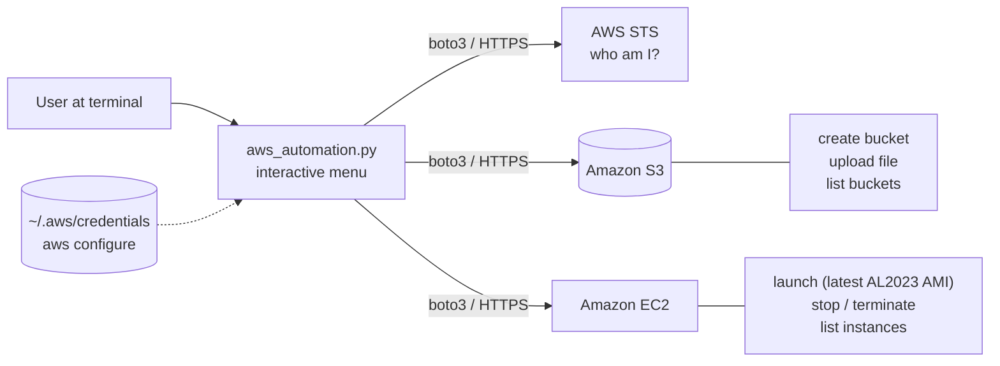
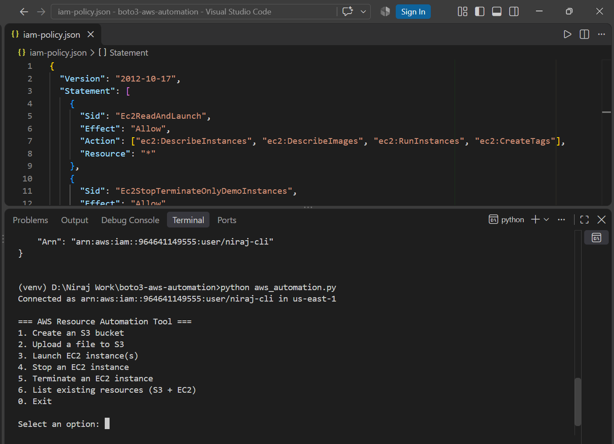
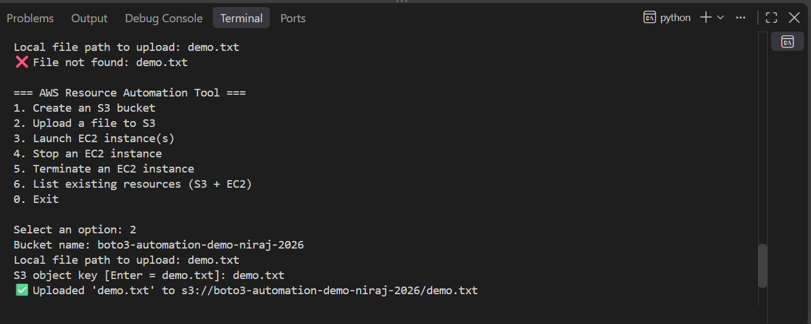
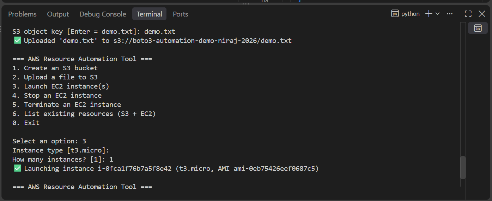
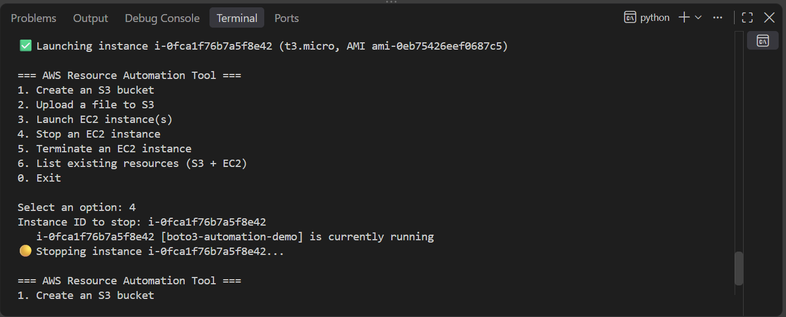
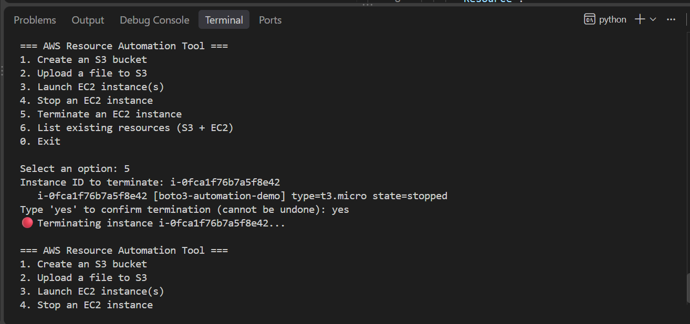

# AWS Resource Automation with Python (boto3)

A command-line tool that creates and manages AWS resources - S3 buckets, file uploads and
EC2 instances - with Python and **boto3**, replacing manual clicking in the AWS Console.

## Objective
Automate the creation and management of AWS resources through code: create an S3 bucket,
upload files, launch / stop / terminate EC2 instances and list what exists, all from one
interactive menu.

## AWS Services / Technologies
| Service | Used for |
|---|---|
| **Amazon S3** | Create buckets, upload files, list buckets |
| **Amazon EC2** | Launch, stop and terminate instances; look up the latest Amazon Linux 2023 AMI; list instances |
| **AWS IAM** | Credentials and a least-privilege policy for the tool (`iam-policy.json`) |
| **AWS STS** | Verifies the credentials at start-up (`get_caller_identity`) |
| **Python 3 + boto3** | The automation itself |

## Architecture / Workflow



**Start-up:** read region + credentials -> reject an invalid region -> call STS to confirm
the credentials work and print who you are connected as -> show the menu.
**Each menu option** maps to one or more boto3 calls and prints a clear success or error line.

| Menu option | boto3 calls |
|---|---|
| 1. Create S3 bucket | `s3.create_bucket` (adds `LocationConstraint` outside us-east-1) |
| 2. Upload file | `s3.upload_file` |
| 3. Launch EC2 | `ec2.describe_images` (newest AL2023) -> `ec2.create_instances` (tagged `boto3-automation-demo`) |
| 4. Stop instance | `ec2.describe_instances` (shows name/state) -> `ec2.stop_instances` |
| 5. Terminate instance | `ec2.describe_instances` (shows name/state) -> asks `yes` -> `ec2.terminate_instances` |
| 6. List resources | `s3.list_buckets`, `ec2.describe_instances` (hides terminated) |

## Features and safeguards
- **Region check:** values such as `Global` (not a real region) are rejected with the fix command.
- **Latest AMI is looked up at run time** - no hard-coded AMI ID that goes stale.
- **Terminate safety:** prints the instance's name, type and state and requires typing `yes`.
- **Launch cap:** at most 5 instances per launch; invalid numbers are rejected.
- **Windows-friendly:** handles quoted paths (`"C:\Users\...\photo 1.jpg"`) and uses the file name as the S3 key.
- **Input validation:** S3 bucket-name rules are checked before calling AWS.
- **Clean failures:** bad credentials or network problems print a message, not a stack trace.

## Prerequisites
- Python 3.8+ and an AWS account
- An IAM user with an access key (see *Security*)
- AWS CLI v2 (for `aws configure`)

## How to Run

**1. Get the code and install dependencies**
```bash
git clone https://github.com/<your-username>/<this-repo>.git
cd <this-repo>

python -m venv venv
venv\Scripts\activate            # Windows
# source venv/bin/activate       # macOS / Linux

pip install -r requirements.txt
```

**2. Configure credentials and a real region**
```bash
aws configure
#   AWS Access Key ID:      <your IAM user's key>
#   AWS Secret Access Key:  <your secret>
#   Default region name:    us-east-1        <- a real region code, NOT "Global"
#   Default output format:  json
aws sts get-caller-identity      # should print your account and user ARN
```

**3. Run it**
```bash
python aws_automation.py
```
You should see `Connected as arn:aws:iam::...:user/<you> in us-east-1` and the menu.

**Suggested demo order:** `6` list -> `1` create bucket -> `2` upload a file -> `3` launch ->
`6` list -> `4` stop -> `5` terminate -> `6` list. Take a screenshot of each step.

## Screenshots
Run the tool yourself and save your screenshots with these names (in `screenshots/`):

| File | What it shows |
|---|---|
| `01-connected-menu.png` | "Connected as ..." line and the menu |
| `02-create-bucket.png` | Option 1 - bucket created |
| `03-upload-file.png` | Option 2 - file uploaded |
| `04-launch-instance.png` | Option 3 - instance launched |
| `05-stop-instance.png` | Option 4 - instance stopping |
| `06-terminate-instance.png` | Option 5 - confirmation prompt + terminating |
| `07-list-resources.png` | Option 6 - buckets and instances |
| `08-s3-console.png` | S3 console: the new bucket with the uploaded file |
| `09-ec2-console.png` | EC2 console: the instance state (stopped / terminated) |









## Live verification (AWS account, us-east-1)
The same API operations the tool performs were run against a real AWS account to confirm
the whole lifecycle works:

| Step | Operation | Result |
|---|---|---|
| Create bucket | `CreateBucket` | `boto3-automation-demo-1791500846` created |
| Upload | `PutObject` | `demo.txt` (62 bytes) stored in the bucket |
| Launch | `DescribeImages` + `RunInstances` | `t3.micro` on the newest Amazon Linux 2023 AMI, tagged `boto3-automation-demo`, reached **running** |
| Stop | `StopInstances` | running -> stopping -> **stopped** |
| Terminate | `TerminateInstances` | stopped -> **terminated** |
| List | `ListBuckets`, `DescribeInstances` | new bucket listed; terminated instance no longer shown |

Offline tests of the script's own logic (menu flow, Windows paths, input validation,
region and credential errors) - 17 checks - also pass.

## Security
- **Never commit credentials.** `.gitignore` excludes `.aws/`, `*.pem`, `*.env` and `credentials`.
  Keys live only in `~/.aws/credentials` created by `aws configure`.
- **Use a dedicated IAM user, not the root account**, and delete or rotate any key that was ever
  pasted somewhere public.
- **Least privilege:** [`iam-policy.json`](iam-policy.json) grants only what the tool needs:
  - EC2 describe / launch / tag
  - **Stop and terminate only on instances tagged `Name = boto3-automation-demo`** - instances
    created by anything else (for example an Auto Scaling group) cannot be stopped or terminated
  - S3 create/upload only on buckets named `boto3-automation-demo-*`; list all buckets
- The policy was checked with the **IAM policy simulator** (13 cases): the tool's own actions are
  allowed; stopping/terminating untagged instances, creating other buckets, `s3:DeleteBucket`
  and `iam:CreateUser` are denied.
- With this restricted policy, name buckets `boto3-automation-demo-<something>`. For unrestricted
  names use a broader policy, and expect that to be less safe.

## What happens when something fails?
| Situation | Behaviour |
|---|---|
| No credentials | Prints "No AWS credentials found. Run `aws configure`" and exits |
| Wrong or revoked keys | Prints that AWS rejected the credentials and exits |
| Invalid region (e.g. `Global`) | Rejected with `aws configure set region us-east-1` |
| Bucket name taken / invalid | Invalid names are caught locally; AWS errors are printed |
| File path wrong | "File not found" - nothing is uploaded |
| Launch blocked (e.g. vCPU quota) | The AWS error text is printed; nothing is created |
| Wrong instance ID | "Could not find instance ..." - nothing is changed |
| Network / endpoint problem | "Could not reach AWS" - menu continues |

## Key Learnings
- **Region matters.** Instances are regional: the tool lists EC2 in the configured region only, while S3
  bucket names are global. `Global` is not a region - it broke the first `aws configure` attempt.
- **Eventual consistency.** Asking EC2 about an instance a split second after `RunInstances` can return
  `InvalidInstanceID.NotFound`. Real code should use waiters such as `instance.wait_until_running()`.
- **Account quotas.** EC2 limits are counted in vCPUs (a `t3.micro` is 2 vCPUs); launches fail with a clear
  error once the quota is used up, so check Service Quotas before scripting launches.
- **Resource vs client API.** `ec2.create_instances` (resource) returns objects you can act on; the client API
  returns raw dictionaries - both are used here where each is clearer.
- **Look up AMIs, don't hard-code them** - AMI IDs differ per region and go out of date.
- **Windows paths** use backslashes and may arrive in quotes; handle both or uploads get awkward keys.
- **Tag-based IAM conditions** make automation safe to run next to other people's resources.

## What I Would Improve in Production
- `--dry-run` and non-interactive `argparse` sub-commands so it can run in CI.
- Use boto3 waiters and paginators (`describe_instances` returns at most one page of results).
- Structured logging instead of `print`, and retries with back-off.
- A "delete bucket / empty bucket" action and support for choosing a region per command.
- Run it from an IAM role or SSO profile instead of long-lived access keys.
- Add unit tests with `moto` in CI.
